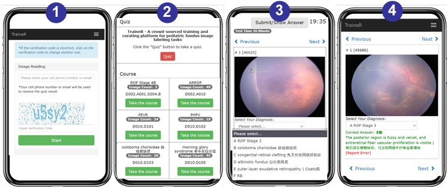

# TraineR

An online training and quiz system for pediatric fundus image reading, maily concerning ROP (Retinopathy of Prematurity). 
It aims to help inexperienced medical staff to quickly master image labeling tasks for fundus image-based AI.     

If you use this system, please cite:
```
[1] TraineR: A crowd training platform for deep learning image labeling tasks. Software Impacts. 2022, doi: 10.1016/j.simpa.2022.100450.
```


An online demo (authentication and integration with EMRS have been removed for guest convenience): 
http://trainer.zhangys.org.cn   
You should not edit and save any content directly on the demo site. Instead, deploy your own site to persist data. 

Frontend:   


Backend:   


# Build

1. git clone https://github.com/zhangys11/TraineR.git
2. Use Visual Studio 2022 to open System.App.Web.TraineR.sln. Open it as an ASP.net MVC web site.
3. Visual Studio will automatically download and install necessary nuget packages.
4. Build and Run

# Deploy

1. In Visual Studio, publish the project to a local folder.
2. Deploy the folder in IIS 7. Use a .Net 4 application pool.  
3. Under folder /System.App.Web.TraineR/App_Data, we provide two s3db files. TraineR.cn.s3db and TraineR.en.s3db are the Chinese/English version quiz banks. 
4. At runtime, the system can dynamically switch between different language databases with users' GUI operation.
5. Users can also edit the TraineR.xx.s3db file to build their own test banks for other language and general-purposed image reading and labeling tasks.   
6. In Web.config, specify your own database connection string, as follows,  

```
<connectionStrings>
	<!-- Each account uses its own database, but all DictXXX tables and Account table are shared (use default db). -->
	<add name="quizbank.en" connectionString="data source=|DataDirectory|\TraineR.en.s3db;Version=3;" providerName="System.Data.SQLite" />
	<add name="quizbank.cn" connectionString="data source=|DataDirectory|\TraineR.cn.s3db;Version=3;" providerName="System.Data.SQLite" />
	<add name="quizbank.jp" connectionString="data source=|DataDirectory|\TraineR.jp.s3db;Version=3;" providerName="System.Data.SQLite" />
	<add name="quizbank.dk" connectionString="data source=|DataDirectory|\TraineR.dk.s3db;Version=3;" providerName="System.Data.SQLite" />
</connectionStrings>
```

# Docker (out of maintenance)

1. `docker pull zhangyinsheng/trainer:latest`  
2. `docker run --name trainer -p 8000:80 zhangyinsheng/trainer:latest`  
3. You can now access http://localhost:8000
